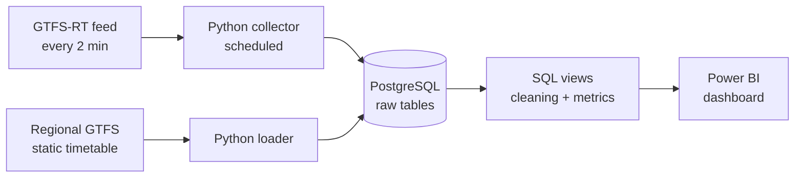

# TER Hauts-de-France Reliability

Line-by-line reliability of TER Hauts-de-France trains, rebuilt from archived SNCF real-time data (Python, PostgreSQL, Power BI).

> 🚧 **Work in progress.** Phase 0 (feasibility) is underway. See [Project status](#project-status).

## Context & question

**Which TER Hauts-de-France lines are the least reliable, when, and where should the Region focus its efforts?**

The Hauts-de-France Region, which organises regional rail services, is treated as a (fictional) client. The project ends with **at most three quantified recommendations**.

Official open data only publishes TER punctuality **per region and per month**. No public source gives reliability per line. This project rebuilds that dataset by archiving the SNCF GTFS-RT real-time feed for 4 to 8 weeks, then analyses it in SQL and presents it in Power BI.

Sub-questions:

- Delay rate and cancellation rate per line.
- Variation by time of day (peak vs off-peak) and day of week.
- Delay distribution: many small delays, or a few very large ones?
- Gap between these figures and the official regional average.

**Out of scope:** delay prediction (machine learning) and root-cause analysis. The data does not contain causes.

## Data sources

| Source | Role | Licence |
| --- | --- | --- |
| [SNCF GTFS-RT Trip Updates, all services](https://transport.data.gouv.fr/resources/83583) | Actual delays and cancellations. Refreshed every 2 min and covers trains in the next 60 min. Includes TGV, Intercités and TER. Not archived by the publisher. | ODbL |
| [Hauts-de-France regional GTFS](https://transport.data.gouv.fr/resources/83620/download) ("Trains régionaux Hauts-de-France mobilités") | Official scope: lines, trips, stops and timetables for the next 90 days. | Not specified |
| [SNCF national TER GTFS](https://eu.ftp.opendatasoft.com/sncf/plandata/export-ter-gtfs-last.zip) | Cross-check of the regional GTFS. | ODbL |
| [Monthly TER punctuality](https://ressources.data.sncf.com/explore/dataset/regularite-mensuelle-ter/) (SNCF Open Data) | Official regional benchmark (5-minute threshold at terminus), used to validate the computed figures. | ODbL |

Attribution: data © SNCF and Région Hauts-de-France, distributed via [transport.data.gouv.fr](https://transport.data.gouv.fr) and [SNCF Open Data](https://ressources.data.sncf.com).
**No raw or derived data is committed to this repository.**

## Architecture



Python only moves data. All analytical logic lives in SQL, inside the database. Raw observations are never modified, so every metric can be recomputed.

## Data model

*Coming in phase 1 (entity-relationship diagram).*

## Method

Design decisions are logged in [`DECISIONS.md`](DECISIONS.md). So far:

- **Scope (D1):** 65 rail lines from the regional GTFS. Coach lines and lines likely run by TER Grand Est are excluded.
- **Trip key (D2):** train number + service date, because GTFS `trip_id`s change between exports.

## Key findings

*Coming in phase 4.*

## Recommendations

*Coming in phase 6.*

## Limitations

- **Short observation window:** 4 to 8 weeks in autumn 2026, so the results are not representative of a full year.
- **Feed coverage:** a scheduled train missing from the feed is treated as missing data, not as on time. The match rate between scheduled and observed trains is tracked. The feed has known quality issues.
- **Scope:** the attribution of a few lines serving the Aisne department is still to be confirmed (see D1).

## Project status

- [ ] **Phase 0:** Feasibility test and go / no-go decision ([report](docs/phase0_feasibility.md))
- [ ] **Phase 1:** Static reference data in PostgreSQL
- [ ] **Phase 2:** Automated collection (4 weeks minimum)
- [ ] **Phase 3:** Transformation and validation against official figures ([data quality report](docs/data_quality.md))
- [ ] **Phase 4:** SQL analysis
- [ ] **Phase 5:** Power BI dashboard
- [ ] **Phase 6:** Recommendations and publication

## Repository layout

```
src/         Python scripts (collection and loading only)
sql/         SQL files, organised by phase
docs/        Feasibility and data quality reports
dashboard/   Power BI file and screenshots
data/        Local data, ignored by git
```

## Running locally

Requires Python 3.11+.

```bash
python -m venv .venv
source .venv/bin/activate        # Windows: .venv\Scripts\activate
pip install -r requirements.txt
cp .env.example .env             # then fill in the values
python src/phase0_lire_flux.py
```
